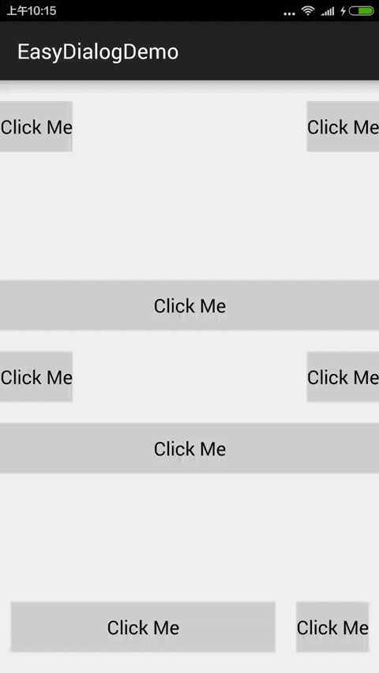

# EasyDialog
## A lightweight, flexible tip dialog in Android

Demo can be download in GooglePlay


<a href="https://play.google.com/store/apps/details?id=com.michael.easydialogdemo">
  
</a>





A lightweight, flexible tip dialog in Android.You can custom the dialog style easily，set the TipView location, background color,animations,just only one line code!!!
This Project and Demo is open source in github.

###Special Thanks<br/>
Feature "Added left and right gravity" was contributed by [akihiro0228](https://github.com/akihiro0228)

Issue "The triangle's right margin is not suitable on low density screens" was contributed by [vigilancer](https://github.com/vigilancer)


## How to use

```groovy
dependencies {
  compile 'com.github.michaelye.easydialog:easydialog:1.4'
}
```

<br/>

```java
     View view = this.getLayoutInflater().inflate(R.layout.layout_tip_content_horizontal, null);
     new EasyDialog(MainActivity.this)
     // .setLayoutResourceId(R.layout.layout_tip_content_horizontal)//layout resource id
        .setLayout(view)
        .setBackgroundColor(MainActivity.this.getResources().getColor(R.color.background_color_black))
     // .setLocation(new location[])//point in screen
        .setLocationByAttachedView(btnTopLeft)
        .setGravity(EasyDialog.GRAVITY_BOTTOM)
        .setAnimationTranslationShow(EasyDialog.DIRECTION_X, 1000, -600, 100, -50, 50, 0)
        .setAnimationAlphaShow(1000, 0.3f, 1.0f)
        .setAnimationTranslationDismiss(EasyDialog.DIRECTION_X, 500, -50, 800)
        .setAnimationAlphaDismiss(500, 1.0f, 0.0f)
        .setTouchOutsideDismiss(true)
        .setMatchParent(true)
        .setMarginLeftAndRight(24, 24)
        .setOutsideColor(MainActivity.this.getResources().getColor(R.color.outside_color_trans))
        .show();
```

## License

Use and distribution of licensed under the Apache2.0 license. See the [LICENSE](https://github.com/michaelye/EasyDialog/blob/master/LICENSE) file for full text.


